# **AI SDR — Yapay Zekâ Satış Asistanı**

**# Takım Adı**

HALLEDERİZ - Team 9

**## Takım Rolleri**

\- Zeynep İbiş: Product Owner

\- Rumeysa Songür: Scrum Master

\- Furkan Çeşitler: Developer

\- Taha Demirkan: Developer

\- Zehra Nur Gölünç: Developer

**## Ürün Adı**

\--AI SDR — Yapay Zekâ Satış Asistanı--

**## Ürün Açıklaması**

\- AI SDR, ajanslar ve B2B hizmet firmaları için hedef müşterileri bulan, her birini derinlemesine araştıran, kişiselleştirilmiş ilk temas mesajını (e-posta + LinkedIn) üreten, insan onayından sonra gönderen, gelen yanıtları sınıflandırıp toplantı ayarlayan ve satış kapandığında sözleşmeyi otomatik hazırlayan no-code + AI satış sistemidir. Yaklaşımımız "çoğa az" değil "aza derin": binlerce kişiye genel mesaj atmak yerine, az sayıda hedefe gerçek araştırmaya dayalı, yüksek kaliteli ve isabetli temas kurmak.

**## Ürün Özellikleri**

\- Sektör/kritere uygun hedef firma bulma.

\- Firma web sitesi ve haberlerini analiz ederek "neden şimdi konuşmalı" sinyali çıkarma.

\- ICP uyum ve satın alma sinyaline göre otomatik skorlama.

\- Firmaya özel, araştırmaya dayalı e-posta ve LinkedIn mesajı üretimi.

\- İnsan onayı sonrası otomatik gönderim

\- Gelen yanıtları sınıflandırma ve olumlu dönüşlerde otomatik toplantı ayarlama.

\- Toplantı öncesi firma özeti (brief) hazırlama

\- Satış kapandığında sözleşme şablonunu otomatik doldurup gönderme

\- Pipeline ve agent aktivitesini gösteren panel arayüzü.

**## Hedef Kitle**

\- Dijital ajanslar

\- B2B hizmet firmaları

\- Türkiye odaklı satış ekipleri

\- Sürekli yeni müşteri bulma ihtiyacı olan firmalar

**## Ürün Geliştirme Listesi URL'si**

[Trello Panosu](https://trello.com/b/mn6hZJ0Y/ai-sdr-hallederiz-team-9-sprint-1)

\---

**# SPRİNT 1**

**\*\*Backlog düzeni ve Hikaye seçimleri\*\***

Proje boyunca toplam 300 puanlık bir backlog hedeflenmiştir. Bu puan üç sprinte eşit değil, her sprintin doğasına göre dağıtılmıştır: Sprint 1 için 80 puan, Sprint 2 için 140 puan, Sprint 3 için 80 puan hedeflenmiştir. Sprint 1'de öncelik, ürünün vizyonunu netleştirmek, sistem mimarisini tasarlamak ve ekibin teknik/organizasyonel altyapısını kurmak olarak belirlenmiştir. 

Backlog'a şu maddeler alınmıştır: proje fikri ve kazanma tezinin netleştirilmesi, 8 adımlı sistem mimarisinin tasarlanması, teknoloji yığınının belirlenmesi (Make, Claude, Supabase, Apollo, Firecrawl, Tavily, Cal.com, Next.js), ekip rollerinin netleştirilmesi, panel arayüzünün örnek verilerle tasarlanması, geliştirme standartlarının belirlenmesi ve proje yönetim altyapısının kurulması. Gerçek API entegrasyonları bilinçli olarak sonraki sprintlere planlanmıştır. Sprint 1 hedeflenen 80 puanın tamamı tamamlanmıştır.

**\*\*Daily Scrum\*\***

Ekip üyelerinin farklı programları nedeniyle günlük toplantılar sabit bir saatte değil, WhatsApp üzerinden kısa check-in mesajlarıyla yürütülmüştür. Sprint 1 boyunca ekip, ilerlemeyi ve karar noktalarını tartışmak üzere 2 Temmuz'da bir Google Meet toplantısı gerçekleştirmiş, bu toplantıda proje mimarisi ve kod planı ekip olarak birlikte gözden geçirilmiştir. 

\[Sprint 1 Daily Scrum / WP-Meet Ekran Görüntüleri] 

**\*\*Sprint panosu güncellemesi\*\***

Sprint panosu ekran görüntüleri:

### Sprint 1 - Burndown Chart

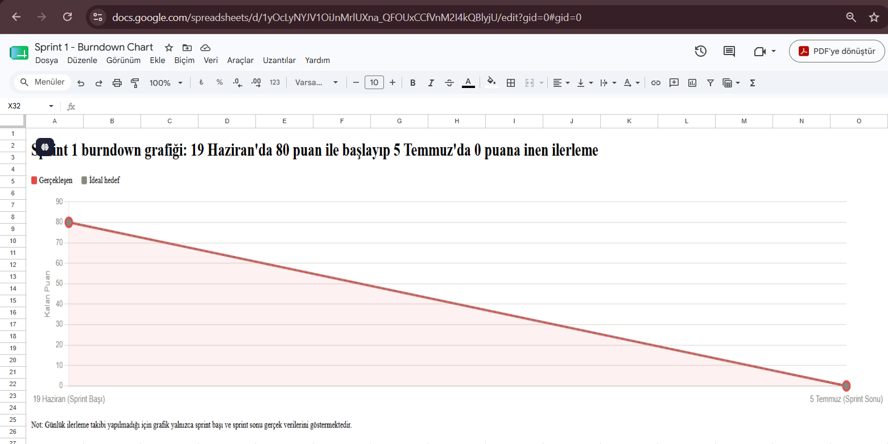

Not: Günlük ilerleme takibi yapılmadığı için grafik yalnızca sprint başı (19 Haziran, 80 puan) ve sprint sonu (5 Temmuz, 0 puan) gerçek verilerini göstermektedir.

**\*\*Ürün Durumu\*\*** 

Next.js ile panel arayüzünün prototipi oluşturulmuştur. Bu prototip, örnek (mock) verilerle görselleştirilmiş olup ürünün hedef kullanıcı deneyimini ve 8 adımlı akışın (Bul-Araştır-Skorla-Yaz-Gönder-Yanıtla-Brief-Kapat) bir arada nasıl çalışacağını göstermektedir. Prototipte yer alan firma isimleri ve mesajlar örnek amaçlıdır, gerçek veri değildir. Gerçek API entegrasyonları (Apollo, Claude API, Make) sonraki sprintlerde tamamlanacaktır.

**\*\*Sprint Review\*\***

Sprint 1'de ekip, ürünün genel vizyonunu ve kazanma tezini netleştirmiştir — "az ama derin" yaklaşımıyla, çok sayıda firmaya genel mesaj atmak yerine az sayıda hedefe derinlemesine araştırmaya dayalı, kişiselleştirilmiş temas kurulması hedeflenmiştir. Sistemin 8 adımlı akışı detaylandırılmış ve her adımın hangi araçla besleneceği belirlenmiştir. Panel arayüzü örnek verilerle tasarlanmış ve ekip tarafından incelenmiştir. Gerçek API entegrasyonlarının henüz kurulmadığı ve bunun bilinçli olarak Sprint 2'ye bırakılması kararı alınmıştır.

Sprint Review katılımcıları: Zeynep İbiş, Rumeysa Songür, Furkan Çeşitler, Taha Demirkan, Zehra Nur Gölünç.

**\*\*Sprint Retrospective\*\***

&#x20;  - Sprint 2'de önceliğin gerçek API entegrasyonlarına (Make akışının kurulması, Apollo ile gerçek firma verisi çekilmesi, Firecrawl/Tavily ile gerçek araştırma, Claude API ile canlı skorlama ve mesaj üretimi) verilmesine karar verilmiştir.

&#x20;  - Supabase hafıza yapısının Sprint 2'de kurulmasına karar verilmiştir.

&#x20;  - İnsan onayı ve gönderim akışının Sprint 2'de gerçek bir e-posta servisiyle entegre edilmesine karar verilmiştir.

&#x20;  - Uçtan uca demoyu tek bir gerçek firma üzerinden göstermenin (dar dikey MVP yaklaşımı) Sprint 2'nin ana hedefi olmasına karar verilmiştir.

&#x20;  - Ekip içi iletişimin Sprint 2'de daha düzenli WhatsApp check-in'leriyle desteklenmesine karar verilmiştir.

\---

**# SPRİNT 2**

**Backlog Dağıtma Mantığı**

Sprint 2 hedefi 140 puan olarak belirlenmiştir. Sprint 1'in aksine bu sprintte öncelik, gerçek API entegrasyonlarının kurulmasına verilmiştir: Make orkestrasyon akışının canlıya alınması, Apollo/Firecrawl/Tavily ile gerçek veri toplama, Claude API ile ICP skorlama ve mesaj üretimi, Supabase hafıza yapısı ve gerçek e-posta gönderim entegrasyonu. Kendi kazanma tezimizle uyumlu olarak "dar dikey MVP" yaklaşımı benimsenmiş — onlarca firma yerine tek bir gerçek firma üzerinden uçtan uca çalışan bir zincir kurmak öncelik olarak belirlenmiştir.

Sprint ortasında ekip, backlog'a **Pazar Araştırması** (ICP netleştirme, rakip analizi, fiyatlandırma/pazar büyüklüğü, pilot firma adayları) maddesini +10 puanla eklemiştir; bu ekleme, Supabase kartının kapsamının MVP'ye göre daraltılmasıyla dengelenmiş, toplam 140 puan sabit tutulmuştur.

<<<<<<< HEAD
**## Ürün Geliştirme Listesi URL'si**
=======
*## Ürün Geliştirme Listesi URL'si**
>>>>>>> dbc94497f39ed6d5c18f31de52ea909f559e6ad1

[Trello Panosu](https://trello.com/b/mn6hZJ0Y/ai-sdr-hallederiz-team-9-sprint-2)

<<<<<<< HEAD
=======

>>>>>>> dbc94497f39ed6d5c18f31de52ea909f559e6ad1
**Daily Scrum Notları**

Ekip, Sprint 2 boyunca WhatsApp üzerinden düzenli check-in'ler yapmaya devam etmiştir. Ayrıca 12 Temmuz ve 18 Temmuz tarihlerinde Google Meet üzerinden iki ayrı toplantı gerçekleştirilmiş; bu toplantılarda entegrasyon durumları, karşılaşılan teknik engeller ve kalan işler ekip olarak birlikte gözden geçirilmiştir.

**Sprint Board Updates**

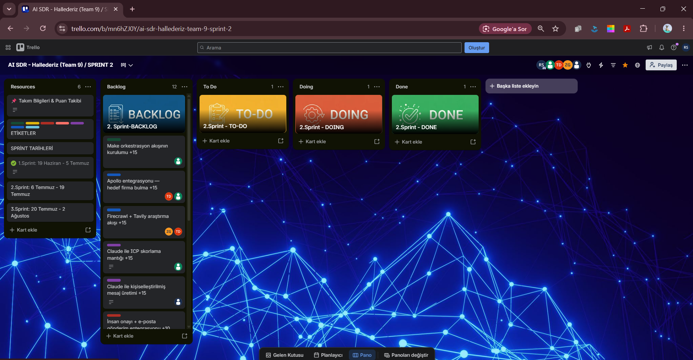
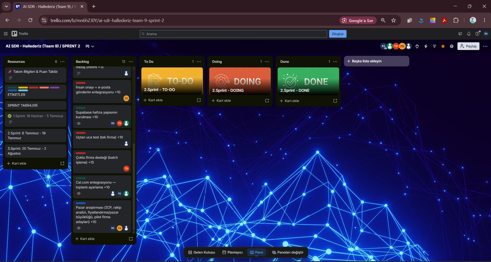
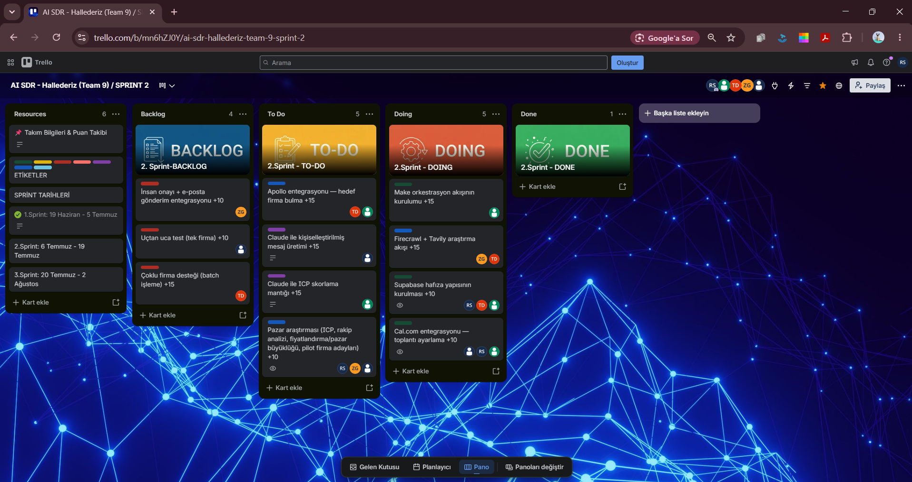
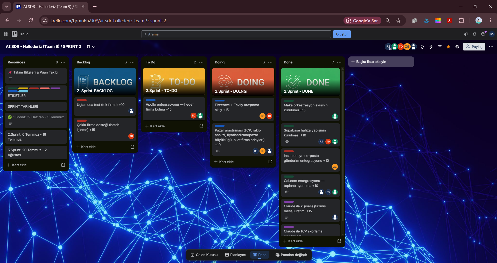
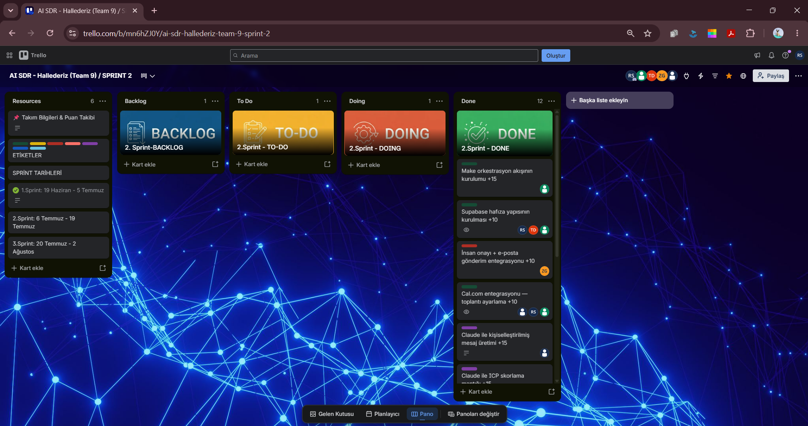
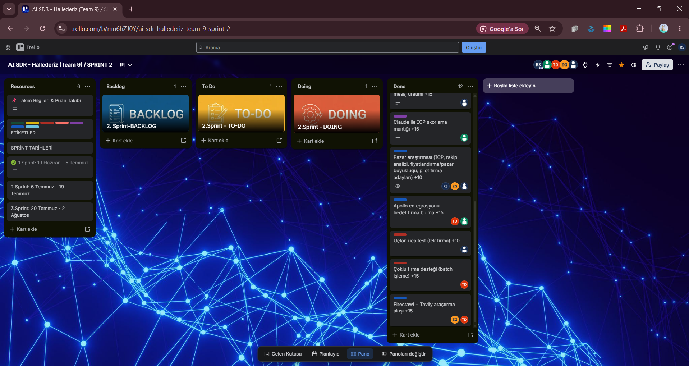

**Ürün Durumu**

Sprint 2'de aşağıdaki entegrasyonlar gerçek API/veri ile kurulmuş ve çalıştırma geçmişiyle (execution history) doğrulanmıştır: Make orkestrasyon akışları (yanıt sınıflandırma, e-posta gönderim, sözleşme taslağı oluşturma) kurulmuş ve başarılı çalıştırmalarla doğrulanmıştır.

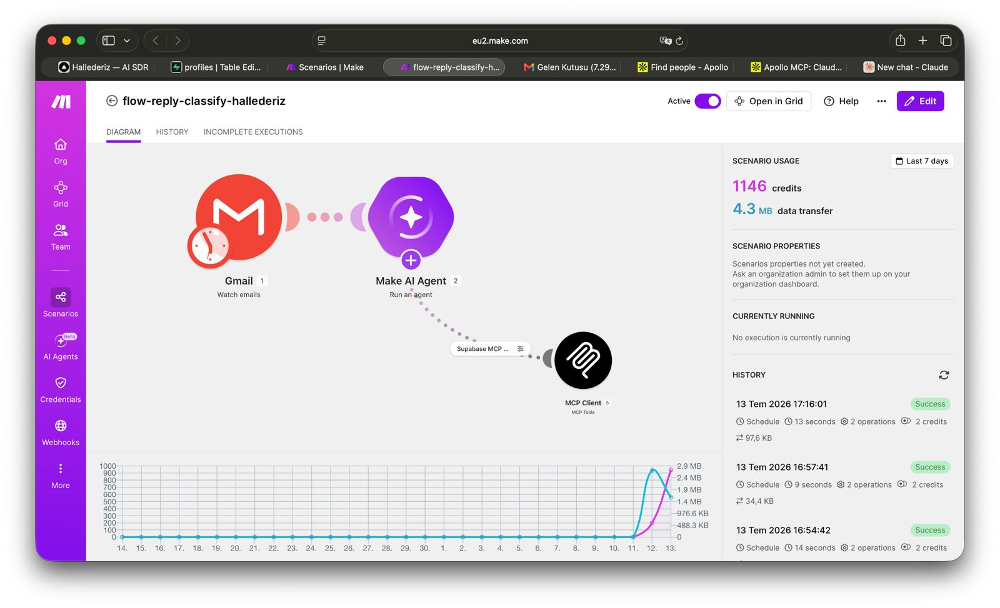

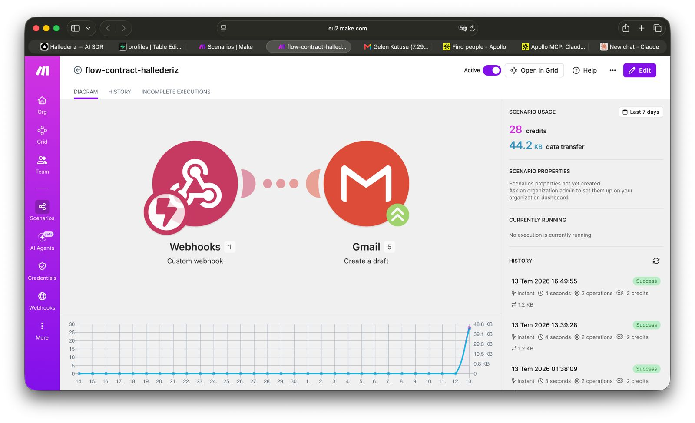

Supabase hafıza yapısı MCP bağlantısı üzerinden Make akışlarına entegre edilmiştir. Cal.com entegrasyonu planlanandan erken tamamlanmıştır. Apollo, Firecrawl ve Tavily ücretsiz katmanda test edilmiş ve çalıştıkları doğrulanmıştır; nihai araç seçimi Sprint 3'e bırakılmıştır. Next.js panel arayüzü hâlâ örnek (mock) verilerle çalışmaktadır, gerçek veriye bağlanma Sprint 3'te tamamlanacaktır.

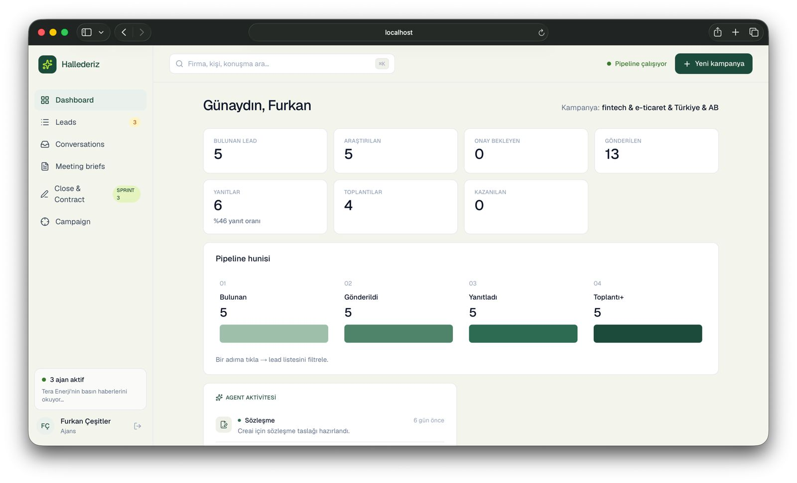
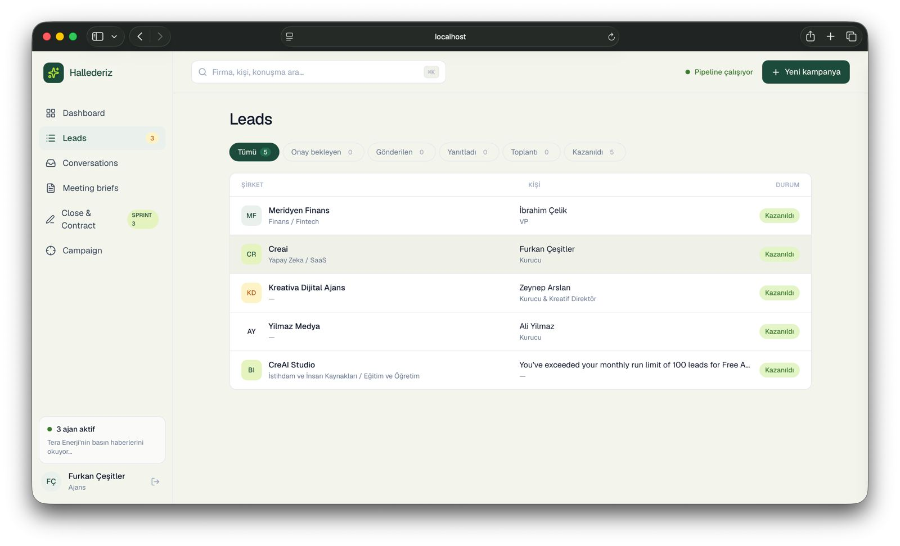
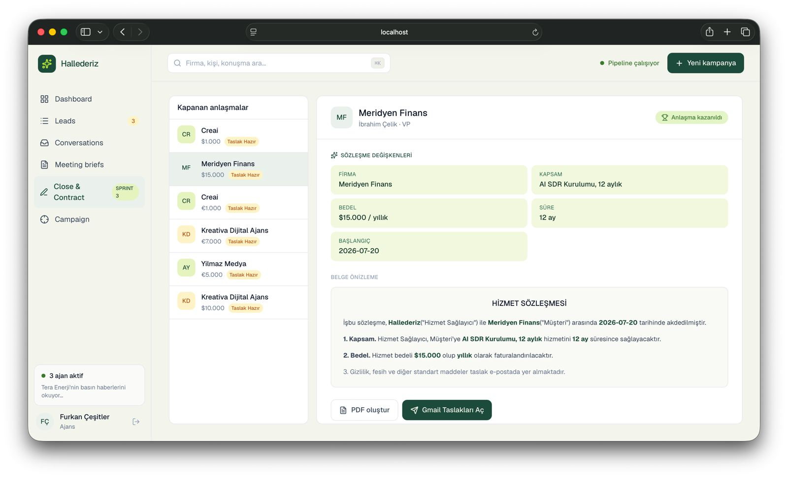
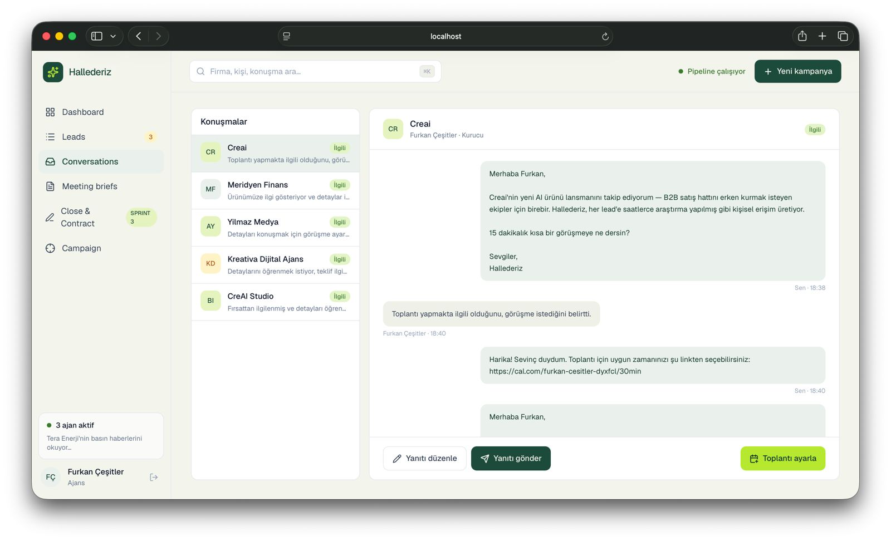
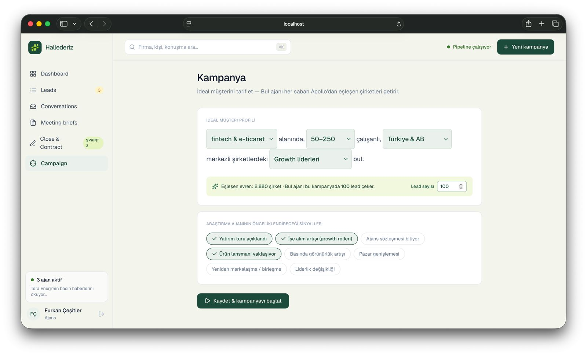
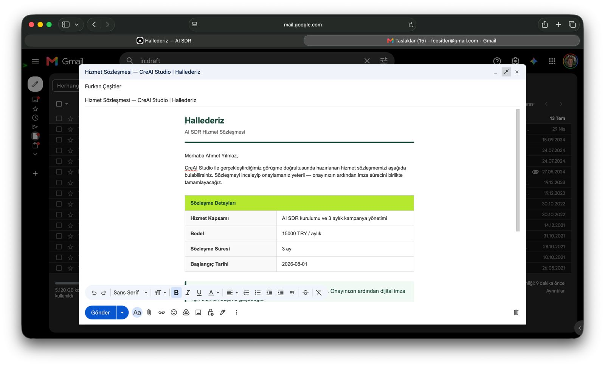

**Sprint Review**

Sprint 2'de ekip, projenin çekirdek otomasyon altyapısını gerçek servislerle kurmuştur. Make üzerinde üç ayrı akış (yanıt sınıflandırma, e-posta gönderim, sözleşme taslağı) canlıya alınmış ve gerçek çalıştırmalarla test edilmiştir. Supabase ile hafıza yapısı entegre edilmiş, Cal.com entegrasyonu planlanandan önce tamamlanmıştır. Apollo, Firecrawl ve Tavily araçları ücretsiz katmanda denenmiş ve çalıştıkları görülmüş, ancak nihai araç seçimi bilinçli olarak Sprint 3'e bırakılmıştır. Bul→Araştır→Skorla→Yaz zincirinin geri kalanı (Apollo tam entegrasyonu, Claude ICP skorlama, Claude mesaj üretimi) Sprint 3'e devretmiştir.

Sprint Review katılımcıları: Zeynep İbiş, Rumeysa Songür, Furkan Çeşitler, Taha Demirkan, Zehra Nur Gölünç.

**Sprint Retrospective**

- Apollo, Firecrawl ve Tavily'nin üçü de ücretsiz katmanda denenmiş, üçünün de teknik olarak çalıştığı görülmüştür; ancak hangisinin/hangilerinin nihai üründe kullanılacağına dair karar, maliyet ve veri kalitesi karşılaştırması yapılabilmesi için Sprint 3'e bırakılmıştır.
- Make üzerinde kurulan otomasyonların (yanıt sınıflandırma, e-posta gönderim, sözleşme taslağı) beklenenden erken ve sorunsuz çalışması, ekibin Sprint 3'te asıl zamanını Bul→Araştır→Skorla→Yaz zincirine ayırabilmesini sağlamıştır.
- Cal.com entegrasyonunun planlanandan (Sprint 3) önce, Sprint 2'de tamamlanması olumlu bir sapma olarak değerlendirilmiş ve Sprint 3 backlog'undan çıkarılmıştır.
- Supabase hafıza yapısının kapsamı, çoklu firma yönetimi yerine MVP'nin (tek firma, uçtan uca zincir) ihtiyacına göre daraltılmıştır; tam kapasiteli yapı Sprint 3'te, ölçeklenme aşamasında ele alınacaktır.
- Next.js panel arayüzünün hâlâ mock veriyle çalıştığı ve gerçek Supabase verisine henüz bağlanmadığı ekip tarafından not edilmiştir; bu bağlantının Sprint 3'te kurulmasına karar verilmiştir.
- Sprint 3'ün öncelik sırası şu şekilde belirlenmiştir: (1) Apollo'nun nihai entegrasyonu, (2) Claude API ile ICP skorlama, (3) Claude API ile kişiselleştirilmiş mesaj üretimi, (4) tek gerçek firma ile uçtan uca test, (5) panel arayüzünün gerçek veriyle bağlanması, (6) deploy, sunum ve tanıtım videosu hazırlığı.
- Ekip içi iletişimin, Sprint 2'de olduğu gibi WhatsApp check-in'leri ve düzenli Meet toplantılarıyla (12 ve 18 Temmuz'da olduğu gibi) sürdürülmesine karar verilmiştir.

\---

**# SPRİNT 3**

\---

