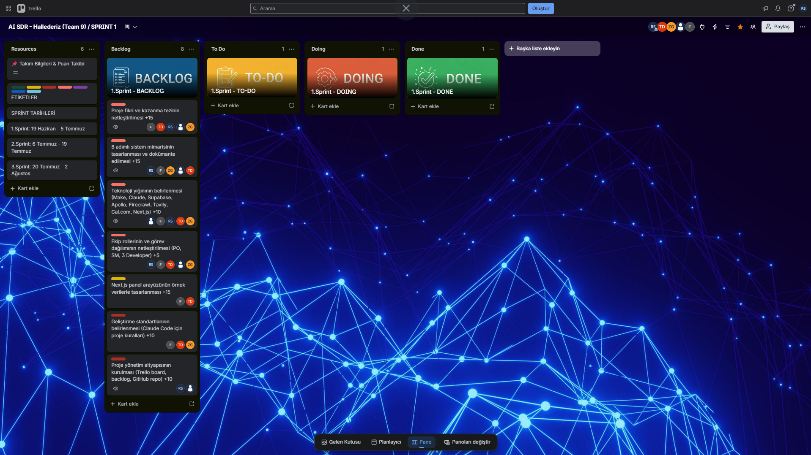
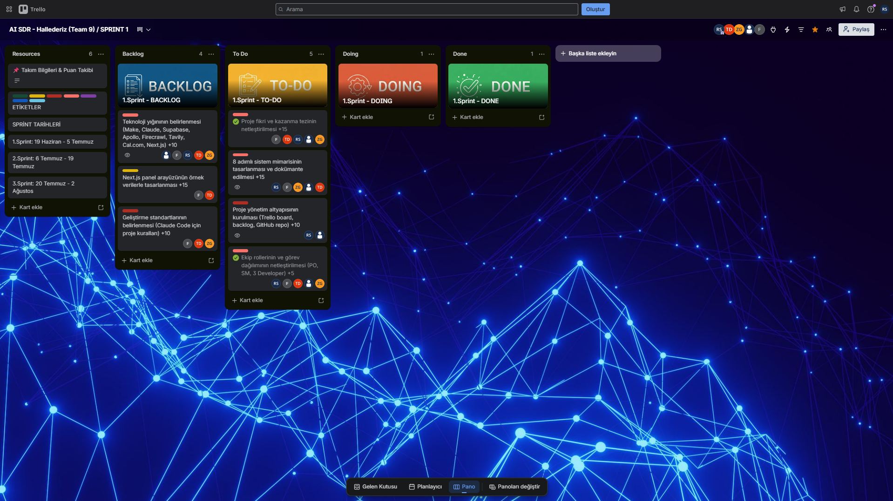
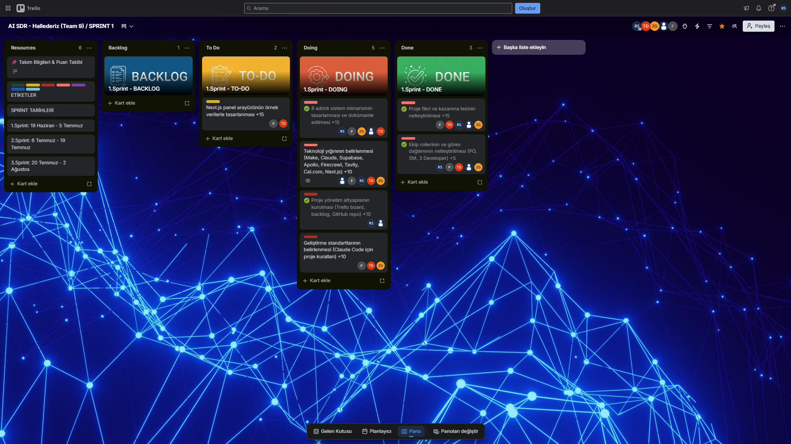
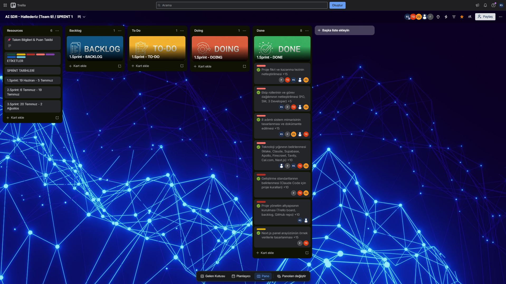
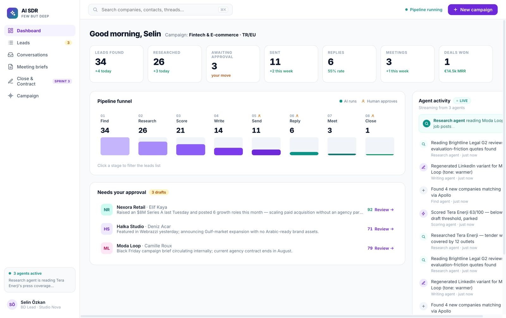
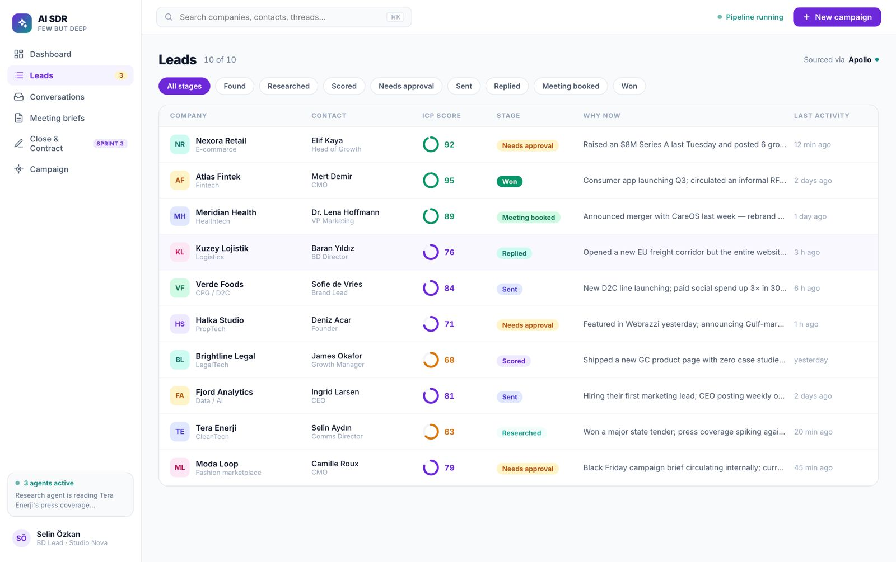
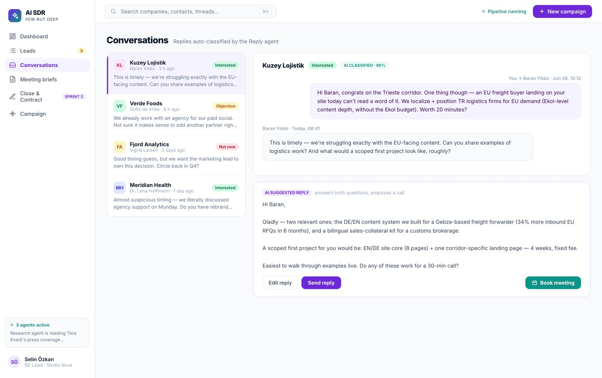
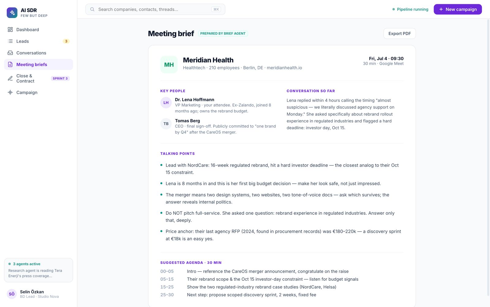
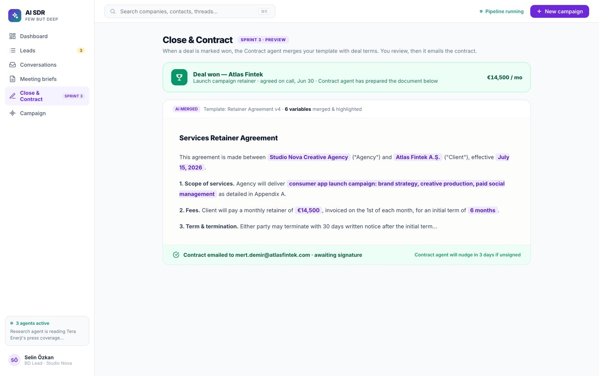
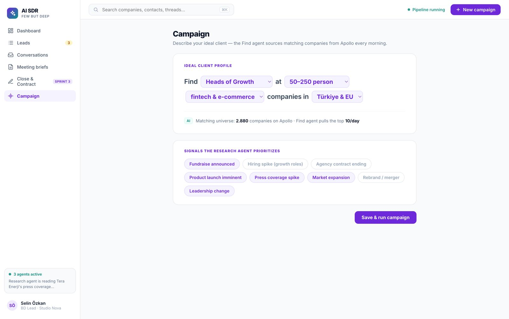

# **AI SDR — Yapay Zekâ Satış Asistanı**

**# Takım Adı**

HALLEDERİZ - Team 9

**## Takım Rolleri**

\- Zeynep İbiş: Product Owner

\- Rumeysa Songür: Scrum Master

\- Furkan Çeşitler: Developer

\- Taha Demirkan: Developer

\- Zehra Nur Gölünç: Developer

**## Ürün Adı**

\--AI SDR — Yapay Zekâ Satış Asistanı--

**## Ürün Açıklaması**

\- AI SDR, ajanslar ve B2B hizmet firmaları için hedef müşterileri bulan, her birini derinlemesine araştıran, kişiselleştirilmiş ilk temas mesajını (e-posta + LinkedIn) üreten, insan onayından sonra gönderen, gelen yanıtları sınıflandırıp toplantı ayarlayan ve satış kapandığında sözleşmeyi otomatik hazırlayan no-code + AI satış sistemidir. Yaklaşımımız "çoğa az" değil "aza derin": binlerce kişiye genel mesaj atmak yerine, az sayıda hedefe gerçek araştırmaya dayalı, yüksek kaliteli ve isabetli temas kurmak.

**## Ürün Özellikleri**

\- Sektör/kritere uygun hedef firma bulma.

\- Firma web sitesi ve haberlerini analiz ederek "neden şimdi konuşmalı" sinyali çıkarma.

\- ICP uyum ve satın alma sinyaline göre otomatik skorlama.

\- Firmaya özel, araştırmaya dayalı e-posta ve LinkedIn mesajı üretimi.

\- İnsan onayı sonrası otomatik gönderim

\- Gelen yanıtları sınıflandırma ve olumlu dönüşlerde otomatik toplantı ayarlama.

\- Toplantı öncesi firma özeti (brief) hazırlama

\- Satış kapandığında sözleşme şablonunu otomatik doldurup gönderme

\- Pipeline ve agent aktivitesini gösteren panel arayüzü.

**## Hedef Kitle**

\- Dijital ajanslar

\- B2B hizmet firmaları

\- Türkiye odaklı satış ekipleri

\- Sürekli yeni müşteri bulma ihtiyacı olan firmalar

**## Ürün Geliştirme Listesi URL'si**

[Trello Panosu](https://trello.com/b/mn6hZJ0Y/ai-sdr-hallederiz-team-9-sprint-1)

\---

**# SPRİNT 1**

**\*\*Backlog düzeni ve Hikaye seçimleri\*\***

Proje boyunca toplam 300 puanlık bir backlog hedeflenmiştir. Bu puan üç sprinte eşit değil, her sprintin doğasına göre dağıtılmıştır: Sprint 1 için 80 puan, Sprint 2 için 140 puan, Sprint 3 için 80 puan hedeflenmiştir. Sprint 1'de öncelik, ürünün vizyonunu netleştirmek, sistem mimarisini tasarlamak ve ekibin teknik/organizasyonel altyapısını kurmak olarak belirlenmiştir. 

Backlog'a şu maddeler alınmıştır: proje fikri ve kazanma tezinin netleştirilmesi, 8 adımlı sistem mimarisinin tasarlanması, teknoloji yığınının belirlenmesi (Make, Claude, Supabase, Apollo, Firecrawl, Tavily, Cal.com, Next.js), ekip rollerinin netleştirilmesi, panel arayüzünün örnek verilerle tasarlanması, geliştirme standartlarının belirlenmesi ve proje yönetim altyapısının kurulması. Gerçek API entegrasyonları bilinçli olarak sonraki sprintlere planlanmıştır. Sprint 1 hedeflenen 80 puanın tamamı tamamlanmıştır.

**\*\*Daily Scrum\*\***

Ekip üyelerinin farklı programları nedeniyle günlük toplantılar sabit bir saatte değil, WhatsApp üzerinden kısa check-in mesajlarıyla yürütülmüştür. Sprint 1 boyunca ekip, ilerlemeyi ve karar noktalarını tartışmak üzere 2 Temmuz'da bir Google Meet toplantısı gerçekleştirmiş, bu toplantıda proje mimarisi ve kod planı ekip olarak birlikte gözden geçirilmiştir. 

\[Sprint 1 Daily Scrum / WP-Meet Ekran Görüntüleri] 

**\*\*Sprint panosu güncellemesi\*\***

Sprint panosu ekran görüntüleri:

**\*\*Ürün Durumu\*\*** 

Next.js ile panel arayüzünün prototipi oluşturulmuştur. Bu prototip, örnek (mock) verilerle görselleştirilmiş olup ürünün hedef kullanıcı deneyimini ve 8 adımlı akışın (Bul-Araştır-Skorla-Yaz-Gönder-Yanıtla-Brief-Kapat) bir arada nasıl çalışacağını göstermektedir. Prototipte yer alan firma isimleri ve mesajlar örnek amaçlıdır, gerçek veri değildir. Gerçek API entegrasyonları (Apollo, Claude API, Make) sonraki sprintlerde tamamlanacaktır.

**\*\*Sprint Review\*\***

Sprint 1'de ekip, ürünün genel vizyonunu ve kazanma tezini netleştirmiştir — "az ama derin" yaklaşımıyla, çok sayıda firmaya genel mesaj atmak yerine az sayıda hedefe derinlemesine araştırmaya dayalı, kişiselleştirilmiş temas kurulması hedeflenmiştir. Sistemin 8 adımlı akışı detaylandırılmış ve her adımın hangi araçla besleneceği belirlenmiştir. Panel arayüzü örnek verilerle tasarlanmış ve ekip tarafından incelenmiştir. Gerçek API entegrasyonlarının henüz kurulmadığı ve bunun bilinçli olarak Sprint 2'ye bırakılması kararı alınmıştır.

Sprint Review katılımcıları: Zeynep İbiş, Rumeysa Songür, Furkan Çeşitler, Taha Demirkan, Zehra Nur Gölünç.

**\*\*Sprint Retrospective\*\***

&#x20;  - Sprint 2'de önceliğin gerçek API entegrasyonlarına (Make akışının kurulması, Apollo ile gerçek firma verisi çekilmesi, Firecrawl/Tavily ile gerçek araştırma, Claude API ile canlı skorlama ve mesaj üretimi) verilmesine karar verilmiştir.

&#x20;  - Supabase hafıza yapısının Sprint 2'de kurulmasına karar verilmiştir.

&#x20;  - İnsan onayı ve gönderim akışının Sprint 2'de gerçek bir e-posta servisiyle entegre edilmesine karar verilmiştir.

&#x20;  - Uçtan uca demoyu tek bir gerçek firma üzerinden göstermenin (dar dikey MVP yaklaşımı) Sprint 2'nin ana hedefi olmasına karar verilmiştir.

&#x20;  - Ekip içi iletişimin Sprint 2'de daha düzenli WhatsApp check-in'leriyle desteklenmesine karar verilmiştir.

\---

**# SPRİNT 2**

\---

**# SPRİNT 3**

\---

